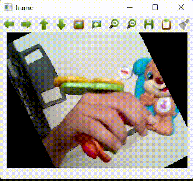

# Camera-Matrix

Até o momento, fizemos transformações de formato em imagens. Fizemos, então, o mesmo em vídeos em tempo real.

A lógica é muito semelhante, com vídeos sendo imagens consecutivas mostradas em uma tela, basta realizar o processo de rotação com cada frame (imagem) que compõe vídeo. Nesse caso, as imagens que estavam sendo captadas pela câmera estavam sendo mostradas em tempo real, mas o mesmo seria possível com um vídeo já pré gravado.

O processo de rotação funciona em algumas etapas. Primeiramente, é necessário trasladar (mover sem distorcer) a imagem para o centro, isso é, centralizar a imagem no ponto (0,0). Realizamos isso ao utilizar uma matrix de translação com as seguintes medidas:

$$
T = 
\begin{bmatrix}
    1 & 0 & \frac{- image_x}{2} \\
    0 & 1 & \frac{- image_y}{2} \\
    0 & 0 & 1
\end{bmatrix}
$$

Para que realizar essa translação? 

        As imagens sempre são alteradas em relação ao centro do plano cartesiano no qual elas estão presentes, portanta, para rotacionar uma imagem em volta de seu eixo, temos que posicionar esse eixo no ponto de origem.


Após isso, podemos realizar o processo de rotação a imagem. Escolhemos 1 grau como a medida de rotação graças ao elevado número de vezes que o programa roda por segundo, assim, diminuindo o pulo entre um frame e outro e deixando o vídeo mais suave. Assim, preenchemos os campos na matriz exemplo (colocada abaixo) e multiplicamos pela matriz de translação.

$$
R = 
\begin{bmatrix}
    \cos(\theta) & -\sin(\theta) & 0 \\
    \cos(\theta) & \cos(\theta) & 0 \\
    0 & 0 & 1
\end{bmatrix}
$$


Após isso, é simplesmente uma questão de transladar a imagem de volta ao seu ponto original, ou seja:

$$
T2 = 
\begin{bmatrix}
    1 & 0 & \frac{image_x}{2} \\
    0 & 1 & \frac{image_y}{2} \\
    0 & 0 & 1
\end{bmatrix}
$$

Agora que o processo de tratamento das matrizes que irão iterar sob a matriz da imagem foi explicado, está na hora de tratar da matriz da imagem.

Ela não é comum, tem uma dimensão de 2x(número de pixels). A primeira linha é a cordenada X de cada pixel, e a segunda é a cordenada Y. Para que seja possível realizar uma multiplicação matricial com as matrizes que estamos utilizando, é necessário o uso da função np.vstack(), que serve para adicionar uam fileira de 1s (ums) que tenha o mesmo comprimento das outras duas linhas abaixo delas. A sua utilidade é puramente pela questão da translação, pois sem ela não seria possível realizar o processo. 

Mesmo assim, ainda há mais um truque para minimizar erros de arredondamento. A inversão do processo de multiplicação de matrizes é essencial na hora de realizar qualquer tipo e modificação. Ao invés de estarmos modificando uma imagem origem, estamos modificando uma saída para que ela volte a origem. Isso é necessário para impedir que erros de arredondamento se mostrem na tela. Uma imagem que é esticada não consegue preencher uma área maior do que sua original, já que não possui pixels o suficiente. Mas, uma imagem achatada consegue. A ideia é que o processo inverso não nos deixa sem pixels cobrindo a tela. 

Dessa maneira, estamos tentando chegar da imagem modificada (image_) a original (image). No código isso fica mais explícito, pois realizamos o processo da multiplicação da mtriz inversa de Xd (imagem_) para chegar em X (imagem).

O resto do processo é multiplicação de matrizes e aplicação de filtros para que pixels fora da tela sejam ignorados. 

Então, é isso, nosso projeto realmente é mais simples do que ele aparente ser. Abaixo há uma versão comentada do código de multiplicação de matrizes, que eplica linha a linha o que está ocorrendo, além de uma imagem que foi furtada de nosso professor Tiago.




```python
# array da imagem com a localização de todos os pixels
image = np.array(frame).astype(float)/255

# array do mesmo tamanho da imagem original, mas preenchidos inteiramente por zeros
image_ = np.zeros_like(image)

# criação de um array com a localização de todos os pixels da imagem
Xd = criar_indices(0, image.shape[0], 0, image.shape[1])
# adição da linha de ums (1s) -->
Xd = np.vstack((Xd,np.ones((1,Xd.shape[1]))))


# matriz de translação para a origem
T = np.array([[1, 0, -(image.shape[0]/2)], [0, 1, -(image.shape[1]/2)], [0, 0,1]])

# matriz de translação inversa a origem
T2 = np.array([[1, 0, (image.shape[0]/2)], [0, 1, (image.shape[1]/2)], [0, 0,1]])

# matriz de rotação
R = np.array([[np.cos(np.radians(deg)), -np.sin(np.radians(deg)), 0], [np.sin(np.radians(deg)), np.cos(np.radians(deg)), 0], [0, 0,1]])

# criação da matriz que realiza o processo completo da alteração da imagem
A = T2 @ R @ T

# criação da matriz da imagem 'original' (reasultante do processo inverso da criação de Xd)
X = np.linalg.inv(A) @ Xd

# trocando todos valores de Float para Int
X = X.astype(int)
Xd = Xd.astype(int)

# Realização de um filtro para ignorar pixels fora da tela
filtro = (X[0,:]>=0)&(X[0,:]<image_.shape[0])&(X[1,:]>=0)&(X[1,:]<image_.shape[1])

# aplicação do filtro
Xd = Xd[:,filtro]
X = X[:,filtro]

# realocação dos pixels da imagem original para a modificada, que será então plotada
image_[Xd[0,:], Xd[1,:], :] = image[X[0,:], X[1,:], :]
